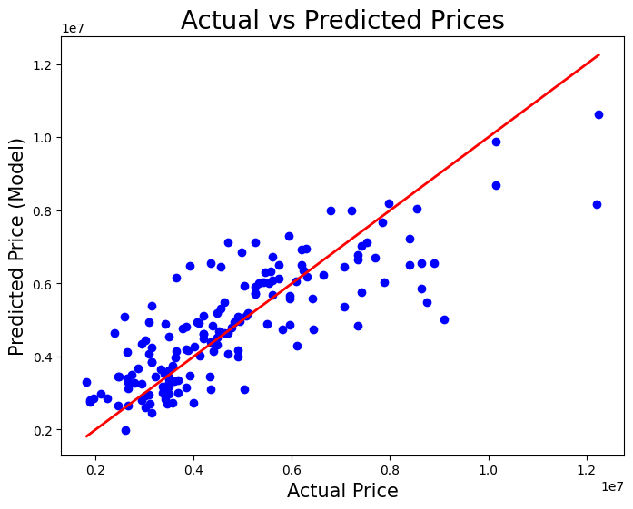
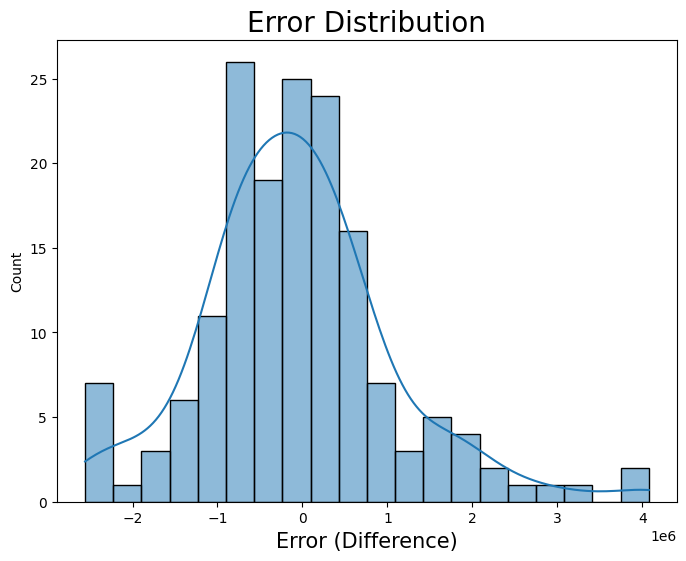

# House Price Prediction

## Project Overview
This project predicts house prices using a **Linear Regression** model based on various property features such as area, number of bedrooms, bathrooms, and furnishing status. The goal is to build a regression model that accurately estimates the price of a house given its attributes.

## Dataset
The dataset (`housing.csv`) contains the following features:

- **Input Features**:
  - `area`: Area of the house in square feet.
  - `bedrooms`: Number of bedrooms.
  - `bathrooms`: Number of bathrooms.
  - `stories`: Number of stories.
  - `mainroad`: Whether the house is on a main road (yes/no).
  - `guestroom`: Whether the house has a guest room (yes/no).
  - `basement`: Whether the house has a basement (yes/no).
  - `hotwaterheating`: Whether the house has hot water heating (yes/no).
  - `airconditioning`: Whether the house has air conditioning (yes/no).
  - `parking`: Number of parking spaces.
  - `prefarea`: Whether the house is in a preferred area (yes/no).
  - `furnishingstatus`: Furnishing status (furnished, semi-furnished, unfurnished).

- **Target Variable**:
  - `price`: Price of the house.

## Installation & Requirements
To run this project, you need **Python** installed along with the following libraries:

```bash
pip install pandas scikit-learn matplotlib seaborn
```

## Usage
1.  **Clone the repository** (if applicable):
    ```bash
    git clone https://github.com/immohitsen/House_Price_Prediction.git
    ```
2.  **Run the Jupyter Notebook**:
    Open `house_model.ipynb` to see the data preprocessing, model training, and evaluation steps.
    ```bash
    jupyter notebook house_model.ipynb
    ```
3.  **Prediction**:
    You can use the saved model (`model/house_model.pkl`) to make predictions on new data. See `predict.ipynb` for an example.

## Model & Preprocessing
- **Preprocessing**:
  - Binary columns (yes/no) are mapped to 1/0.
  - Categorical variables (`furnishingstatus`) are converted using One-Hot Encoding (`pd.get_dummies`).
- **Algorithm**: Linear Regression from `sklearn`.
- **Training/Testing Split**: 70% Training, 30% Testing.

## Results
The model predicts house prices with the following accuracy:
- **R2 Score**: ~0.67 (67.3%)

## Visualizations

1.  **Actual vs Predicted Prices**
    

2.  **Error Distribution**
    
